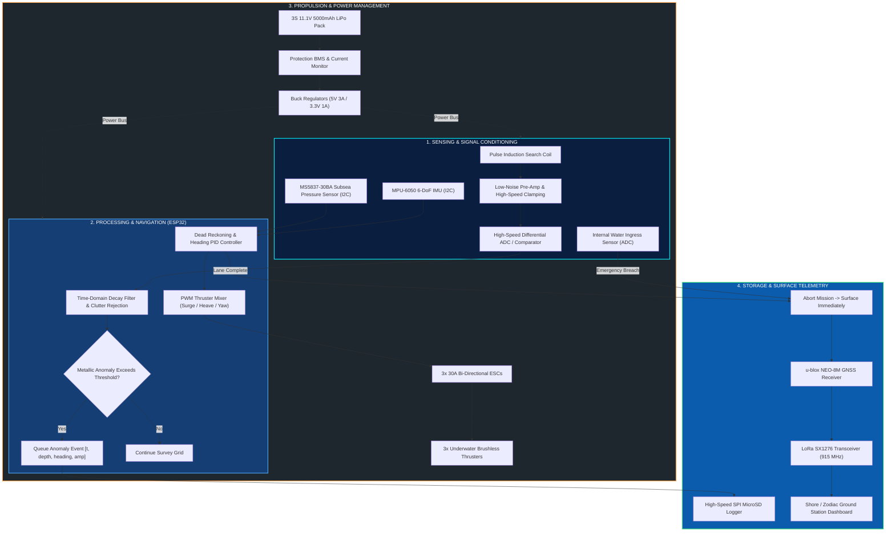

<!-- =========================================================================
     AQUASCAN — AUTONOMOUS UNDERWATER METAL DETECTION SYSTEM
     SMART INDIA HACKATHON (SIH) 2026 | PROBLEM STATEMENT ID: 26064
     THEME: ROBOTICS AND DRONES | CATEGORY: HARDWARE
     APPLICATION: DISASTER MANAGEMENT & OCEAN RESOURCE EXPLORATION
     ========================================================================= -->

<div align="center">

<a href="#-about-aquascan">
  
</a>

<br/>
<br/>

# 🌊 AquaScan
### **Low-Cost Deployable Seafloor Metal Detection Sensor for Ocean Resource Exploration**
*An Autonomous Underwater Vehicle (AUV) Platform for Sub-Bed Hazard Reconnaissance, Post-Disaster Debris Localization, and Coastal Resource Scouting*

<br/>

<!-- OFFICIAL SIH 2026 BADGES -->
[](https://www.sih.gov.in/)
[](https://www.sih.gov.in/)
[](https://www.sih.gov.in/)
[](https://www.sih.gov.in/)
[](https://www.sih.gov.in/)

<br/>

<!-- VIBRANT TECH PILLS -->
[](https://www.espressif.com/)
[-00CEC9?style=flat-square&logo=sonar&logoColor=black)](https://en.wikipedia.org/wiki/Pulse_induction)
[-6C5CE7?style=flat-square&logo=semtech&logoColor=white)](https://lora-alliance.org/)
[](https://www.u-blox.com/)
[](hardware/Components_List.xlsx)
[](docs/Prototyping_Questions.md)
[](LICENSE)

<br/>
<br/>

<!-- OFFICIAL MOTTO RIBBON -->
<a href="images/Quote_Ribbon.svg">
  
</a>

<br/>
<br/>

<!-- WATCH PROTOTYPE VIDEO CALLOUT -->
<a href="https://drive.google.com/file/d/1-9JCb91pg7QasiEg5DUDFaQjWzWoBYyG/view?usp=drivesdk" target="_blank">
  
</a>

<br/>
<br/>

[🎯 Evaluation Card](#-60-second-jury-evaluation-briefing) &nbsp;•&nbsp;
[🪸 Sea Context](#-oceanic-environment--operational-domain) &nbsp;•&nbsp;
[📖 Concept](#-about-aquascan) &nbsp;•&nbsp;
[🚨 Problem & Solution](#-problem-statement--field-gap) &nbsp;•&nbsp;
[🔬 Physics & DSP](#-scientific-foundation--pulse-induction-dsp) &nbsp;•&nbsp;
[🏗️ Architecture](#️-system-architecture) &nbsp;•&nbsp;
[⚙️ Workflow](#️-technical-workflow--state-machine) &nbsp;•&nbsp;
[💰 Hardware & BOM](#-hardware-components--budget-feasibility) &nbsp;•&nbsp;
[🛡️ Risks & Mitigations](#-potential-challenges-risks--mitigation-strategies) &nbsp;•&nbsp;
[🌐 Impact & Stakeholders](#-societal-impact--stakeholder-benefits) &nbsp;•&nbsp;
[👥 Team & Mentor](#-team-aquascan--mentorship) &nbsp;•&nbsp;
[📄 Documents](#-presentation--documentation-assets)

<br/>


</div>

<br/>

> [!IMPORTANT]
> **Official SIH 2026 Submission Alignment:** This repository contains the complete engineering specification, CAD schematics, and embedded source code corresponding to Team AquaScan's official Smart India Hackathon 2026 Idea Submission (Problem Statement ID: **#26064**). 
> **Evaluation Verdict:** *The Idea is Feasible and Ready for Prototyping and Deployment.*

<br/>

---

## 🎯 60-Second Jury Evaluation Briefing

<div align="center">
  
</div>

<br/>

```
┌─────────────────────────────────────────────────────────────────────────────────────────────────┐
│                                SIH 2026 EVALUATION QUICK CARD                                   │
├─────────────────────────┬───────────────────────────────────────────────────────────────────────┤
│ Problem Statement ID    │ #26064 (Theme: Robotics and Drones | Category: Hardware)              │
├─────────────────────────┼───────────────────────────────────────────────────────────────────────┤
│ Core Challenge          │ Existing marine surveys require expensive ships, equipment, and human │
│                         │ effort (₹50L+). Manual inspection is slow and limited in coverage.    │
├─────────────────────────┼───────────────────────────────────────────────────────────────────────┤
│ AquaScan Solution       │ A compact, low-cost AUV integrated with Pulse Induction (PI) sensing, │
│                         │ autonomous zig-zag path execution, local SD logging, & LoRa uplink.  │
├─────────────────────────┼───────────────────────────────────────────────────────────────────────┤
│ Core Technical Pillars  │ SENSE ➔ NAVIGATE ➔ DETECT ➔ PROCESS ➔ STORE ➔ SURFACE ➔ TRANSMIT      │
├─────────────────────────┼───────────────────────────────────────────────────────────────────────┤
│ Silt Penetration        │ Pulse Induction penetrates 0.2–0.5 m under sand/mud where sonar fails.│
├─────────────────────────┼───────────────────────────────────────────────────────────────────────┤
│ Underwater Comms Solved │ Stores data locally, surfaces automatically, then transmits GPS via   │
│                         │ LoRa (915 MHz) to shore station without requiring acoustic modems.    │
├─────────────────────────┼───────────────────────────────────────────────────────────────────────┤
│ Unit BOM Cost           │ Commercial AUV: ₹50,00,000+ ➔ AquaScan Target: < ₹15,000 INR          │
├─────────────────────────┼───────────────────────────────────────────────────────────────────────┤
│ Multi-Sector Impact     │ Fishermen Safety • Coastal Authorities • Marine Research • Port Ops  │
└─────────────────────────┴───────────────────────────────────────────────────────────────────────┘
```

<br/>

### 📊 Competitive Matrix: Commercial Systems vs. AquaScan

| Challenge Addressed (from PPT) | Status Quo Industry Limitation | **AquaScan Engineered Solution** |
| :--- | :--- | :--- |
| **1. High Cost Exploration** | Existing surveys require multi-crore ships, expensive equipment, and heavy diving teams. | **A low-cost, deployable AUV performs initial surveys, reducing capital expenditure by 99.7%.** |
| **2. Slow & Limited Coverage** | Manual diver inspection is time-consuming, hazardous, and covers only small areas. | **Autonomously traverses predefined zig-zag lawnmower paths to scan large seabed areas efficiently.** |
| **3. Hard to Locate Buried Metal**| Metallic objects are buried under sediment/mud, remaining invisible to optical & high-frequency sonar. | **Pulse Induction coil penetrates up to 50 cm of silt, detects eddy currents, and logs coordinates.** |
| **4. No Internet Underwater** | RF and internet do not propagate through conductive seawater; real-time subsea comms is impossible. | **Stores mission data locally on SD card, surfaces automatically, and uplinks georeferenced data via LoRa.** |

<br/>

<div align="center">
  
</div>

---

<br/>

## 🪸 Oceanic Environment & Operational Domain

<div align="center">
  
  <br/>
  <em>Figure 1: The Shallow Littoral Subsea Domain — Bathymetric Seafloor Grid, Silt Stratum, and Deep Light Attenuation</em>
</div>

<br/>

### 🌊 The Bathymetric Coastal Dilemma: 0 to 10 Meters

The marine boundary between **0 and 10 meters depth** is where the greatest concentration of maritime disaster hazards occurs. Yet, it represents a total blindspot for both divers and existing industrial survey robotics:

<br/>

<div align="center">
  
</div>

<br/>

* 🌊 **Surface Layer (0.0 m):** Strong atmospheric sunlight, RF transparent zone. AquaScan reaches this plane to lock onto GNSS satellites and execute long-range LoRa packet broadcasts.
* 🫧 **Turbulent Littoral Band (0.5 – 5.0 m):** Heavy wave surge, suspended monsoonal sediment, zero optical camera visibility, and dangerous structural debris.
* 🪸 **Benthic Seafloor Stratum (5.0 – 10.0 m):** Silt, clay, and marine sand layers that swallow fallen metal objects up to 50 cm deep. AquaScan maintains stable bottom-following cruise altitudes.

<br/>

<div align="center">
  
</div>

---

<br/>

## 🌊 About AquaScan

<div align="center">
  
  <br/>
  <em>Figure 2: AquaScan Autonomous Underwater Vehicle (Subsystem Architecture &amp; Hydrodynamic Hull Layout)</em>
</div>

<br/>

**AquaScan** is an indigenously conceived, low-cost Autonomous Underwater Vehicle (AUV) tailored for sub-seafloor metallic reconnaissance and ocean hazard mitigation. Integrating an onboard **Pulse Induction (PI) Metal Detection Sensor** paired with real-time digital filtering, AquaScan systematically navigates the seabed along an autonomous zig-zag survey grid. 

The vehicle discriminates actionable metallic anomalies from background geological clutter (saline conductivity, basaltic minerals, magnetic sand), logs detection events with high-resolution depth and heading stamps onto local flash media, surfaces autonomously upon lane completion, acquires precision surface GPS fixes, and relays mission metrics over long-range **LoRa RF telemetry**.

### 🔩 Functional Hull Callouts (from Slide 2)
1. **Depth Sensor:** High-precision barometric pressure cell maintaining safe survey altitude above the seabed.
2. **ESP32 Controller:** Dual-core computing unit controlling navigation, digital signal processing, and communication.
3. **Metal Detection Coil (Pulse Induction):** Shielded bow coil inducing eddy currents into buried metallic objects.
4. **IMU Sensor (MPU-6050):** 6-DoF gyroscope and accelerometer maintaining stability, pitch/roll trim, and yaw heading.
5. **Battery Pack:** High-capacity LiPo cell delivering sustained pulse current and thruster propulsion.
6. **SD Card Module:** High-speed SPI flash storage logging every detection point and mission metric locally.
7. **LoRa Telemetry Mast:** 915 MHz long-range radio transmitter broadcasting data to base station upon surfacing.
8. **GPS Module:** High-sensitivity GNSS patch receiver acquiring georeferenced coordinates at the surface.
9. **Brushless Thrusters:** 3-axis thruster configuration providing surge forward drive and differential directional control.

### 🎯 Target Objects for Exploration & Disaster Recovery
* 📦 **Submerged Metal Boxes & Cargo:** Lost transport containers and marine freight.
* 🚰 **Subsea Pipes & Conduits:** Coastal pipelines, sewage outfalls, and offshore infrastructure.
* ⚓ **Lost Anchors & Ship Wreckage:** Maritime navigational hazards and historical cultural artifacts.
* ⛽ **Submerged LPG Cylinders & Flood Debris:** Post-disaster recovery in estuaries and ports.

<br/>

<div align="center">
  
</div>

---

<br/>

## 🚨 Problem Statement & Field Gap

<div align="center">

> ### **Smart India Hackathon 2026 — Problem Statement #26064**
> **Theme:** Robotics and Drones | **Category:** Hardware | **Team:** AquaScan

</div>

<br/>

### The Coastal Disaster Reality
India’s **7,516 km coastline** is subjected to recurring meteorological extremes — from severe cyclonic storms (e.g., Cyclone Michaung, Biparjoy, Tauktae) to catastrophic riverine delta floods. These events drag vehicular wreckage, corrugated metal structures, shipping containers, and subsea industrial debris directly into shallow navigational channels and coastal fishing routes.

<br/>

<div align="center">
  
</div>

<br/>

### 🆘 Three Real-World Disaster Scenarios Where AquaScan Saves Lives

```
  ┌───────────────────────────┐    ┌───────────────────────────┐    ┌───────────────────────────┐
  │   SCENARIO 1: CYCLONE     │    │   SCENARIO 2: FLOOD       │    │   SCENARIO 3: HAZARD      │
  │   PORT CLEARANCE          │    │   DEBRIS RECOVERY         │    │   & PIPELINE INSPECTION   │
  ├───────────────────────────┤    ├───────────────────────────┤    ├───────────────────────────┤
  │ After coastal cyclones,   │    │ Riverine floods submerge  │    │ Lost shipping containers, │
  │ submerged iron sheetings, │    │ vehicles, machinery, and  │    │ sunken fuel drums, and    │
  │ lost anchors, and channel │    │ LPG cylinders beneath mud │    │ damaged shallow pipelines │
  │ debris block harbor entry.│    │ where divers cannot see.  │    │ endanger local navigation.│
  │                           │    │                           │    │                           │
  │ ➔ AquaScan sweeps channel │    │ ➔ AquaScan pinpoints      │    │ ➔ AquaScan surveys route  │
  │   lanes in 45 mins.       │    │   exact GPS locations.    │    │   and flags metal blips.  │
  └───────────────────────────┘    └───────────────────────────┘    └───────────────────────────┘
```

<br/>

<div align="center">
  
</div>

---

<br/>

## 🔬 Scientific Foundation & Pulse Induction DSP

<div align="center">
  
  <br/>
  <em>Figure 3: Oscilloscope Waveform — Transient Pulse, Back-EMF Spike, Saltwater Fast Decay vs. Metallic Eddy Current Retention</em>
</div>

<br/>

### ⚡ The Governing Electromagnetics

When a current pulse through the search coil is rapidly shut off ($\frac{di}{dt} \approx 10^7\,\text{A/s}$), Lenz's Law generates a primary back-EMF spike. This collapsing primary field induces secondary eddy currents in surrounding media:

$$V_{decay}(t) = - \frac{d\Phi}{dt} = V_0 \cdot e^{-\frac{t}{\tau}}$$

Where the decay time constant $\tau$ is determined by the target's self-inductance $L$ and electrical resistance $R$:

$$\tau = \frac{L_{\text{target}}}{R_{\text{target}}}$$

### 🌊 Mathematical Proof: Why AquaScan Is Immune to Saltwater False Alarms
* **Conductive Seawater Decay ($\tau_{\text{salt}} \approx 0.5 - 2\,\mu\text{s}$):** Seawater behaves as a distributed fluid conductor with negligible inductance. Its eddy currents decay almost instantaneously.
* **Buried Metallic Targets ($\tau_{\text{metal}} \ge 25 - 200\,\mu\text{s}$):** Lumped metals (steel plates, iron wreckage, brass) have orders of magnitude higher self-inductance and hold circulating eddy currents well into the late decay phase.
* **Differential Dual-Gate DSP Integration:**

$$\Delta S = \int_{t_{\text{late}}}^{t_{\text{late}}+\Delta t} V_{\text{decay}}(t)\,dt - K \cdot \int_{t_{\text{early}}}^{t_{\text{early}}+\Delta t} V_{\text{decay}}(t)\,dt$$

Where $K$ is the calibrated salinity-normalization coefficient. If $\Delta S > \text{Threshold}$, a high-confidence metallic target is validated and stored.

<br/>

<div align="center">
  
</div>

---

<br/>

## 🏗️ System Architecture

<div align="center">
  
  <br/>
  <em>Figure 4: Electronics &amp; Sensor Interfacing Circuit Schematic</em>
</div>

<br/>

### Multi-Tier Functional Block Diagram



<br/>

<div align="center">
  
</div>

---

<br/>

## ⚙️ Technical Workflow & State Machine

<div align="center">
  
  <br/>
  <em>Figure 5: AquaScan Operational Deployment &amp; Mission Data Flow (From Official SIH Slide 3)</em>
</div>

<br/>

### The 7 Core Operational Phases
```
   [SENSE] ➔ [NAVIGATE] ➔ [DETECT] ➔ [PROCESS] ➔ [STORE] ➔ [SURFACE] ➔ [TRANSMIT]
```

### 📋 Mission Data Record Structure (Local Flash Log)
*Each valid metallic detection event generates a synchronized record on the onboard SD card:*

| Field Name | Recorded Metric | Technical Purpose |
| :--- | :--- | :--- |
| **GPS Position** | Latitude & Longitude (decimal degrees) | Precise geographic location of submerged object |
| **Depth** | Current Depth in meters ($m$) | Seabed immersion depth reference |
| **Metal Signal Strength**| Signal value in microteslas ($\mu\text{T}$) | Detection confidence & target proximity |
| **Timestamp** | Date & Time ($YYYY-MM-DD\ HH:MM:SS$) | Chronological mission record |
| **Mission ID** | Auto-generated alphanumeric key | Survey session indexing and GIS filtering |

```
  [ Detection Event ] ──▶ [ Depth ] ──▶ [ Timestamp ] ──▶ [ Position ] ──▶ [ SPI MicroSD ]
```

<br/>

### Autonomous Mission State Machine

```mermaid
stateDiagram-v2
    [*] --> PRE_DIVE_CHECK : Power On & System Initialization

    state PRE_DIVE_CHECK {
        [*] --> SensorDiagnostics
        SensorDiagnostics --> BatteryVerification : Sensors OK
        BatteryVerification --> GPSAcquisition : Battery > 11.1V
        GPSAcquisition --> CalibrateIMU : Satellite Fix Established
    }

    PRE_DIVE_CHECK --> DIVE_DESCENT : Operator Launch Signal Received
    
    state DIVE_DESCENT {
        VerticalThrusterActive --> TargetDepthLock : Pressure Reaches 0.5–10m Setpoint
    }

    DIVE_DESCENT --> GRID_SURVEY : Depth Stabilized

    state GRID_SURVEY {
        ForwardLawnmowerTrack --> ContinuousPISampling
        ContinuousPISampling --> ClutterFilter
        ClutterFilter --> AnomalyTrigger : Metal Decay Curve Detected
        AnomalyTrigger --> LogToSDCard : Record Event
        LogToSDCard --> ForwardLawnmowerTrack
    }

    GRID_SURVEY --> ASCENT_SURFACE : Lane Complete OR Low Battery OR Leak
    
    state ASCENT_SURFACE {
        ThrustersCutOff --> PositiveBuoyancyRise
        PositiveBuoyancyRise --> MastBreachesWater : Surface Detection
    }

    ASCENT_SURFACE --> TELEMETRY_UPLINK : Surface Verified

    state TELEMETRY_UPLINK {
        ReacquireGPS --> PackageMissionLog
        PackageMissionLog --> TransmitLoRaPacket : Burst to Base Station
        TransmitLoRaPacket --> AwaitNextCommand
    }

    TELEMETRY_UPLINK --> GRID_SURVEY : Next Waypoint Lane
    TELEMETRY_UPLINK --> [*] : Mission Complete / Operator Recovery
```



<br/>

<div align="center">
  
</div>

---

<br/>

## 🔩 Hardware Components & Budget Feasibility

### 💰 Itemized Bill of Materials (BOM) — Target Under ₹15,000 INR

*Proof of financial attainability: Sourced from accessible Indian distributors.*

| Ref | Item Category | Specific Part Number / Description | Qty | Unit Price (INR) | Ext. Cost (INR) | Procurement Source |
| :---: | :--- | :--- | :---: | :---: | :---: | :--- |
| **U1** | Central Microcontroller | **ESP32-WROOM-32D Development Board** | 1 | ₹420 | ₹420 | Robu.in / ElectronicsComp |
| **U2** | Metal Detection Sensor | **Custom PI Search Coil + NE5534 + IRF9540** | 1 | ₹1,450 | ₹1,450 | Custom Wound / Local PCB |
| **U3** | Attitude / Heading IMU | **MPU-6050 6-Axis Gyro/Accelerometer** | 1 | ₹180 | ₹180 | Robu.in |
| **U4** | Depth / Pressure Sensor | **MS5837-30BA High-Resolution Subsea I2C** | 1 | ₹2,800 | ₹2,800 | Marine Robotics Vendor |
| **U5** | Surface GPS Module | **u-blox NEO-8M GNSS + Ceramic Patch** | 1 | ₹750 | ₹750 | Robu.in |
| **U6** | Telemetry Transceiver | **Semtech SX1276 LoRa 915MHz Module** | 1 | ₹480 | ₹480 | ElectronicsComp |
| **U7** | Mission Data Storage | **High-Speed SPI MicroSD Adapter + 32GB Card**| 1 | ₹350 | ₹350 | Local Electronics |
| **M1-3**| Thruster Propulsion | **Brushless 1000KV Underwater Thrusters** | 3 | ₹1,200 | ₹3,600 | Robu.in / Robokits |
| **E1-3**| Motor Drivers | **30A Waterproof Bidirectional ESCs** | 3 | ₹450 | ₹1,350 | Robu.in |
| **B1** | Primary Power Cell | **Orange 3S 11.1V 5000mAh 30C LiPo Battery** | 1 | ₹1,850 | ₹1,850 | Robu.in |
| **P1** | Power Regulation | **LM2596 Step-Down Buck + 3S Protection BMS** | 1 | ₹320 | ₹320 | Robu.in |
| **H1** | Pressure Hull Body | **110mm Heavy PVC / Acrylic Tube + End Flanges**| 1 | ₹950 | ₹950 | Local Industrial Plastics |
| **H2** | Seals & Bulkheads | **Dual Nitrile O-Rings + Delrin CNC End-Caps** | 1 | ₹650 | ₹650 | 3D Printed / Lathe Work |
| **H3** | Cable Penetrators | **M10 Brass Subsea Feedthroughs + Marine Epoxy**| 6 | ₹90 | ₹540 | Marine Hardware |
| **MISC**| Wiring & Hardware | **Stainless 304 Fasteners, Sealant, Heatshrink**| - | ₹450 | ₹450 | Local Hardware |
| **TOTAL**| **COMPLETE VEHICLE BOM**| **Turnkey AUV Platform Target Cost** | | | **₹14,790 INR** | *Well within ₹15k target!* |

> 📁 *For full datasheets, distributor SKUs, and tolerances, see [hardware/Components_List.xlsx](file:///d:/sih%20pro/hardware/Components_List.xlsx).*

<br/>

<div align="center">
  
</div>

---

<br/>

## 🛡️ Potential Challenges, Risks & Mitigation Strategies

*Directly corresponding to Slide 4 of the official SIH 2026 Idea Submission:*

| # | Challenge / Risk | Impact | Likelihood | Risk Level | Proposed Mitigation Strategy |
| :-: | :--- | :---: | :---: | :---: | :--- |
| **1** | **Water leakage & corrosion**<br/>*Damage to electronics due to high water pressure and saltwater.* | **High** | Medium | **High** | **Waterproof & Rugged Design:**<br/>• Use IP68-rated waterproof casing<br/>• Employ corrosion-resistant marine-grade materials<br/>• Rigorous dual-O-ring sealing and hydrostatic pressure bench testing |
| **2** | **Sensor noise & false detection**<br/>*Interference from seabed minerals, rocks, and saltwater.* | Medium | **High** | **Medium** | **Adaptive Signal Filtering:**<br/>• Use digital signal processing and ML models<br/>• Calibrate decay baseline for different seabed conditions<br/>• Fuse multi-sensor IMU/depth data for confirmed triggers |
| **3** | **Limited battery life**<br/>*Affects mission duration and repeated survey runs.* | Medium | Medium | **Medium** | **Power Optimization:**<br/>• Low-power components and ESP32 sleep modes<br/>• Efficient mission planning (optimized zig-zag paths)<br/>• High-capacity 5000mAh rechargeable LiPo pack |
| **4** | **Communication range & delay**<br/>*Underwater radio transmission is physically impossible.* | Low | Medium | **Low** | **Reliable Surface Telemetry:**<br/>• Store data locally on non-volatile SD flash<br/>• Automatic surfacing + LoRa (5 km line-of-sight)<br/>• Real-time alerts to ground station when link establishes |

<br/>

<div align="center">
  
</div>

---

<br/>

## 🌐 Societal Impact & Stakeholder Benefits

<div align="center">

### *"Safer Seas for a Sustainable Tomorrow"*
**SCAN • DETECT • PROTECT**

</div>

<br/>

*Derived directly from Slide 5 of the official SIH 2026 Idea Submission:*

```
┌─────────────────────────────────┬─────────────────────────────────┐
│ 🐟 FOR FISHERMEN                │ ⚓ FOR COASTAL AUTHORITIES      │
├─────────────────────────────────┼─────────────────────────────────┤
│ • Safer shallow fishing zones   │ • Supports search & rescue ops  │
│ • Drastic reduction in net snag │ • Assists in coastal monitoring │
│   and equipment loss            │ • Useful for disaster management│
│ • Real-time alerts on hazards   │   and illegal activity tracking │
├─────────────────────────────────┼─────────────────────────────────┤
│ 🔬 FOR MARINE RESEARCHERS       │ 🏭 FOR PORTS & OFFSHORE INDUSTRY│
├─────────────────────────────────┼─────────────────────────────────┤
│ • Fast, affordable seafloor map │ • Detects submerged cables, lost│
│ • Deep sediment data collection │   anchors, and channel debris   │
│ • Open platform for academic    │ • Safer port navigation         │
│   marine robotics research      │ • Reduces downtime and dredging │
└─────────────────────────────────┴─────────────────────────────────┘
```

<br/>

<div align="center">
  
</div>

---

<br/>

## 👥 Team AquaScan & Mentorship

<div align="center">

### 🏆 Smart India Hackathon 2026 — Team AquaScan
*Problem Statement ID: #26064 | Theme: Robotics and Drones*

<br/>

| S.No | Member Name | Role / Responsibility | Domain Focus |
| :---: | :--- | :--- | :--- |
| **1** | **MLSNS LAKSHMI** | **Mentor** | Technical Guidance, Research Review & Strategy |
| **2** | **S. Pravallika** | **Project Manager & Team Leader** | Project Coordination, System Architecture & Documentation |
| **3** | **K. Mohan Krishna** | **Research & Documentation Lead** | Marine Domain Research, Literature Review & SIH Deliverables |
| **4** | **K. Vamsi Dhar** | **Embedded Systems Engineer** | ESP32 Firmware, Sensor Fusion & Real-Time DSP Signal Filtering |
| **5** | **G. Kavya** | **Electronics & PCB Design Engineer** | Pulse Induction Circuit, Analog Front-End & Power Management |
| **6** | **G. Chandhra Sekhar**| **Mechanical & CAD Design Engineer** | Hydrodynamic Hull CAD, O-Ring Sealing & Buoyancy Trim |
| **7** | **G. Hemanth Manikanta**| **Testing & Validation Engineer** | QA Diagnostics, Sensor Calibration, Test-Bed & Safety Fail-Safes |

<br/>

<a href="images/Github_Ribbon.svg">
  
</a>

</div>

<br/>

<div align="center">
  
</div>

---

<br/>

## 📚 Key Research & Literature References

*Indexed directly from Slide 6 of the official SIH 2026 Idea Submission:*

1. **Underwater Metal Detection Techniques** — *IEEE Access* (2021). Focus: Electromagnetics & Pulse Induction for marine hazard localization.
2. **Autonomous Underwater Vehicles (AUVs)** — *IEEE OCEANS Conference* (2022). Focus: Motion control, navigation, and shallow-water dynamics.
3. **Underwater Localization and Mapping** — *Springer: Journal of Marine Science* (2021). Focus: Multi-sensor dead reckoning and surface GNSS fusion.
4. **Marine Debris Detection using AI** — *ScienceDirect* (2023). Focus: Automated classification of submerged hazards and clutter rejection.
5. **Ocean Exploration Initiatives (India)** — *National Institute of Ocean Technology (NIOT) / Ministry of Earth Sciences (MoES) Technical Report* (2022).

---

<br/>

## 📄 Presentation & Documentation Assets

All verified technical files, presentations, and engineering records are organized within this repository:

* 🎥 **System Demonstration Video:** [Google Drive Prototype Video](https://drive.google.com/file/d/1-9JCb91pg7QasiEg5DUDFaQjWzWoBYyG/view?usp=drivesdk)
* 📊 **Official SIH Final Pitch Deck:** [presentation/SIH_AquaScan_Final.pptx](file:///d:/sih%20pro/presentation/SIH_AquaScan_Final.pptx)
* 📋 **Official Problem Statement:** [docs/Problem_Statement.pdf](file:///d:/sih%20pro/docs/Problem_Statement.pdf)
* 📐 **System Architecture Whitepaper:** [docs/System_Architecture.pdf](file:///d:/sih%20pro/docs/System_Architecture.pdf)
* 🔬 **Research References Compendium:** [docs/Research_References.pdf](file:///d:/sih%20pro/docs/Research_References.pdf)
* 🔌 **Circuit Diagram Schematic:** [hardware/Circuit_Diagram.png](file:///d:/sih%20pro/hardware/Circuit_Diagram.png)
* 💰 **Itemized Bill of Materials (BOM):** [hardware/Components_List.xlsx](file:///d:/sih%20pro/hardware/Components_List.xlsx)
* ❓ **Technical Prototyping FAQ:** [docs/Prototyping_Questions.md](file:///d:/sih%20pro/docs/Prototyping_Questions.md)

---

<br/>

## 📄 License

This repository and all associated hardware design files, firmware code, and documentation are licensed under the **MIT License**. See the [LICENSE](LICENSE) file for complete terms.

```
MIT License — Copyright (c) 2026 Team AquaScan | Smart India Hackathon 2026
```

---

<br/>

<div align="center">

## 🌊 Closing Quote

<br/>

> *"Exploring the unseen depths through intelligent innovation for safer and sustainable oceans."*
>
> — **Team AquaScan**, Smart India Hackathon 2026

<br/>

---

<br/>

**Smart India Hackathon 2026 | Problem Statement #26064 | Robotics and Drones**  
*Proudly Designed & Engineered with 🤍 in India 🇮🇳*

<br/>

[](https://www.sih.gov.in/)
[](https://github.com/)

</div>
