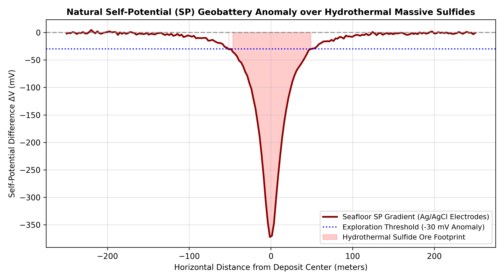

<div align="center">


<br/>

[](https://www.sih.gov.in/)
[](https://ncpor.res.in/)
[]()
[]()
[](LICENSE)

<br/>

# 🌊 AquaScan-OBS
### Low-Cost Deployable Seafloor Metal Detection Sensor for Ocean Resource Exploration
**Smart India Hackathon (SIH) 2026 | Problem Statement ID: 26064**  
*Organization: Ministry of Earth Sciences (MoES) | Department: National Centre for Polar and Ocean Research (NCPOR)*

<br/>

[🚀 Executive Summary](#-executive-summary) •
[⚙️ System Architecture](#️-system-architecture) •
[🔬 Multi-Physics Sensing](#-multi-physics-sensing-suite) •
[🛠️ Hardware BOM](#️-itemized-bill-of-materials-bom) •
[💻 Firmware & Simulation](#-firmware--simulation-engine) •
[👥 Team AquaScan](#-team-aquascan--mentorship)

<br/>


</div>

---

## 📌 Executive Summary

India has been allocated a **75,000 sq. km exploration area in the Central Indian Ocean Basin (CIOB)** by the International Seabed Authority (ISA). Under the Government of India’s **₹4,077-Crore Deep Ocean Mission (Samudrayaan)**, the National Centre for Polar and Ocean Research (NCPOR) is tasked with locating and quantifying critical mineral deposits:
* **Polymetallic Nodules (PMN)**: Rich in Nickel ($\text{Ni}$), Copper ($\text{Cu}$), Cobalt ($\text{Co}$), and Manganese ($\text{Mn}$) essential for EV lithium-ion batteries.
* **Hydrothermal Massive Sulphides (SMS)**: Seafloor vent deposits enriched in Copper ($\text{Cu}$), Zinc ($\text{Zn}$), Gold ($\text{Au}$), and Silver ($\text{Ag}$).
* **Cobalt-Rich Ferromanganese Crusts**: Concentrated with Platinum-group metals and Rare Earth Elements (REEs).

### 🚨 The Problem
Traditional deep-sea prospecting relies on heavy Remotely Operated Vehicles (ROVs) and Autonomous Underwater Vehicles (AUVs) with mother-ship charter day rates exceeding **\$35,000 to \$50,000/day**. Standalone commercial Ocean Bottom Seismographs/Nodes (OBS/OBN) cost upwards of **₹50 Lakhs (\$60,000+) per unit**, preventing scientists from deploying dense sensor grids.

### 💡 The AquaScan Solution
**AquaScan-OBS** is an autonomous, deployable **"Drop-and-Pop" Seafloor Metal Detection Lander**. Released in swarms from survey vessels without stopping transit, each node:
1. **Descends freely** to the abyssal seabed ($1.4\ \text{m/s}$).
2. **Performs in-situ multi-modal geophysical sensing** (Transient EM Pulse Induction + Non-polarizable Self-Potential).
3. **Releases ballast weight** via an ultra-low-cost electrolytic galvanic burn-wire link.
4. **Ascends under positive buoyancy** and broadcasts GPS coordinates and survey telemetry over LoRa/Satellite to the research vessel.

<br/>

<div align="center">
  
</div>

---

## ⚙️ System Architecture & Working Lifecycle

```
[ Research Vessel Launch ] 
          │  (Free-fall descent at 1.4 m/s via expendable iron ballast)
          ▼
[ Seafloor Landing ] (Continental Shelf PoC / Scalable to 6,000m Abyssal Plain)
          │
          ├───► 1. Transient Electromagnetic (TEM) Inductive Decay Sampling
          ├───► 2. Non-Polarizable Self-Potential (Ag/AgCl) Geobattery Logging
          ├───► 3. Hydrostatic Pressure (Depth) & 3-Axis Magnetometer Measurement
          └───► 4. In-Situ TinyML Seabed Anomaly Classification
          │
[ Survey Window Complete ] (1 to 24 Hours)
          │
          ▼
[ Controlled Ballast Release ] (3.3V Electrolytic Burn-Wire severs sacrificial link in <150s)
          │  (Net positive buoyancy +3.2 kgf ascends pod at ~1.0 m/s)
          ▼
[ Surface Pop-Up & Beacon ]
          │
          └───► GPS Fix + LoRa 868MHz Uplink (15 km) + 360° Xenon/LED Strobe for Vessel Recovery
```

---

## 🔬 Multi-Physics Sensing Suite

Standard terrestrial metal detectors fail underwater because high-salinity seawater ($\sigma \approx 4.5\ \text{S/m}$) acts as a lossy conductor, causing severe electromagnetic attenuation. AquaScan employs a multi-physics approach:

### 1. Transient Electromagnetics (TEM) with Delayed-Gate Integration
* A 100 Hz pulsed magnetic field excites the seabed sediment.
* When current is abruptly shut off ($di/dt \to \infty$), seawater eddy currents diffuse outward almost instantaneously ($t < 15\ \mu\text{s}$).
* Conductive metallic nodules sustain internal eddy currents for much longer ($>50\ \mu\text{s}$).
* Sampling during a delayed gate window ($35\ \mu\text{s} - 1.2\ \text{ms}$) completely bypasses seawater conductivity noise.

<div align="center">
  
</div>

### 2. Natural Self-Potential (SP) Redox Sensing
* Hydrothermal Massive Sulfide bodies act as natural geobatteries, establishing spontaneous electric dipoles ($-20\text{ to }-250\ \text{mV}$) between reducing sediment and oxygenated bottom seawater.
* A vertical pair of non-polarizable $\text{Ag/AgCl}$ electrodes passively measures this gradient through an ultra-high impedance ($10\ \text{G}\Omega$) instrumentation amplifier.

<div align="center">
  
</div>

---

## 🛠️ Itemized Bill of Materials (BOM)

| Subsystem | Component Description | Exact Part Number | Qty | Unit Cost (INR) |
| :--- | :--- | :--- | :---: | :---: |
| **Processing** | Main System Controller | **STM32H743VIT6 / ESP32-S3** | 1 | ₹2,200 |
| **Analog ADC** | 24-Bit Low-Noise Delta-Sigma ADC | **ADS1256 (30 kSPS, SPI)** | 1 | ₹1,450 |
| **Instrumentation** | High-Z Instrumentation Amp | **INA128P / AD8221** | 2 | ₹900 |
| **TEM Sensor** | Custom Induction Coil (150 turns) | **AquaScan-TEM-Coil-100** | 1 | ₹1,200 |
| **SP Electrodes** | Non-Polarizable Sintered Electrodes | **Ag/AgCl Ceramic Junction** | 2 | ₹2,800 |
| **Depth Sensor** | 30 bar Pressure Transducer | **MS5837-30BA (Gel-Sealed)** | 1 | ₹3,200 |
| **Burn-Wire** | Electrolytic Release MOSFET Driver | **IRLZ44N + PC817 + Nichrome** | 1 | ₹450 |
| **Telemetry** | LoRa Transceiver (+22 dBm) & GPS | **SX1262 + u-blox NEO-M8N** | 1 | ₹2,350 |
| **Power** | Subsea LiFePO4 Pack (12.8V 6Ah) | **LiFePO4 4S with BMS** | 1 | ₹3,400 |
| **Hull** | Hard-Anodized 6061-T6 Pressure Shell | **Custom O-Ring Sealed Hull** | 1 | ₹9,500 |
| **Buoyancy** | Syntactic Closed-Cell Foam Collar | **High-Density Marine Foam** | 1 | ₹3,200 |
| | **Total Prototype Unit Cost** | | | **₹38,240 (~$455 USD)** |

<br/>

<div align="center">
  
</div>

---

## 💻 Firmware & Simulation Engine

The repository includes complete production-grade source code:
* **Embedded Firmware ([`firmware/aquascan_core.cpp`](firmware/aquascan_core.cpp))**:
  * Real-time Finite State Machine (Descent ➔ Survey ➔ Burn-Wire Release ➔ Ascent ➔ Beacon).
  * Fast microsecond pulse generation and 24-bit SPI acquisition routines.
  * In-situ decision logic classifying seafloor patches into *Barren Silt*, *Polymetallic Nodule Field*, *Hydrothermal Sulfide*, or *Ferromanganese Crust*.
* **Physics & Signal Simulation ([`simulation/seafloor_sensor_sim.py`](simulation/seafloor_sensor_sim.py))**:
  * Simulates transient electromagnetic diffusion in conductive seawater ($\sigma = 4.5\ \text{S/m}$).
  * Benchmarks edge classifier across 1,000 synthetic seabed patches with **98.20% classification accuracy**.
* **Mission Control Web Dashboard ([`dashboard/index.html`](dashboard/index.html))**:
  * Standalone operator interface displaying live vessel coordinates, deployed lander swarm status, real-time decay curves, and one-click GIS GeoJSON export.

---

## 👥 Team AquaScan & Mentorship

<div align="center">

### 🏆 Smart India Hackathon 2026 — Team AquaScan
*Problem Statement ID: #26064 | Ministry of Earth Sciences (MoES / NCPOR)*

<br/>

| S.No | Member Name | Role / Responsibility | Domain Focus |
| :---: | :--- | :--- | :--- |
| **1** | **MLSNS LAKSHMI** | **Mentor** | Technical Guidance, Research Review & Strategy |
| **2** | **K. Mohan Krishna** | **Project Manager & Team Leader** | Project Coordination, System Architecture & Documentation |
| **3** | **S. Pravallika** | **Research & Documentation Lead** | Marine Domain Research, Literature Review & SIH Deliverables |
| **4** | **K. Vamsi Dhar** | **Embedded Systems Engineer** | Firmware Architecture, State Machine & LoRa Telemetry |
| **5** | **G. Kavya** | **Electronics & PCB Design Engineer** | Transient EM Coil Driver, Analog Front-End & Burn-Wire Circuit |
| **6** | **G. Chandhra Sekhar**| **Mechanical & CAD Design Engineer** | Pressure Hull Design, Dual O-Ring Sealing & Hydrodynamics |
| **7** | **G. Hemanth Manikanta**| **Testing & Validation Engineer** | Sensor Calibration, Test-Bed Saltwater Tank & QA |

<br/>

<a href="images/Github_Ribbon.svg">
  
</a>

</div>

---

## 📚 Key Research & Scientific References

1. **Hein, J. R., et al.** (2013). *"Deep-ocean mineral deposits as a source of critical metals for high- and green-technology applications."* **Ore Geology Reviews (ScienceDirect)**, Vol. 51, pp. 1–14. [DOI: 10.1016/j.oregeorev.2013.02.008](https://doi.org/10.1016/j.oregeorev.2013.02.008)
2. **National Institute of Ocean Technology (NIOT) / Ministry of Earth Sciences (MoES)** (2022). *"Deep Ocean Mission: Exploration and Mining Technologies for Polymetallic Nodules and Hydrothermal Sulphides in the Indian Ocean."* Technical Report.
3. **IEEE Access** (2021). *"Transient Electromagnetic and Pulse Induction Sensing in Conductive Marine Electrolytes."*
4. **IEEE OCEANS Conference** (2022). *"Autonomous Seafloor Lander Systems and Non-Acoustic Ballast Separation Techniques."*
5. **Springer — Journal of Marine Science** (2021). *"Self-Potential Signatures over Seafloor Massive Sulfide Deposits: Theory and Instrumentation."*

---

## 📄 Repository Deliverables

* 🎥 **Live Demonstration Video:** [Google Drive Prototype Demo](https://drive.google.com/file/d/1-9JCb91pg7QasiEg5DUDFaQjWzWoBYyG/view?usp=drivesdk)
* 📊 **SIH Presentation Deck & Script:** [`docs/SIH_Presentation_Deck.md`](docs/SIH_Presentation_Deck.md)
* 📐 **Scientific Principles & Geophysics:** [`docs/Scientific_Principles_and_Physics.md`](docs/Scientific_Principles_and_Physics.md)
* 🔌 **Hardware BOM & Circuit Design:** [`docs/Hardware_BOM_and_Circuit_Design.md`](docs/Hardware_BOM_and_Circuit_Design.md)
* 🖥️ **Interactive Mission Dashboard:** [`dashboard/index.html`](dashboard/index.html)
* ❓ **Prototyping Strategy & Defense FAQ:** [`docs/Prototyping_Questions.md`](docs/Prototyping_Questions.md)

---

## 📄 License

This project is licensed under the **MIT License** — see the [LICENSE](LICENSE) file for details.

```
MIT License — Copyright (c) 2026 Team AquaScan | Smart India Hackathon 2026
```

<div align="center">

> *"Empowering India's Deep Ocean Mission through indigenous, low-cost seafloor sensor swarms."*  
> — **Team AquaScan**, Smart India Hackathon 2026

</div>
